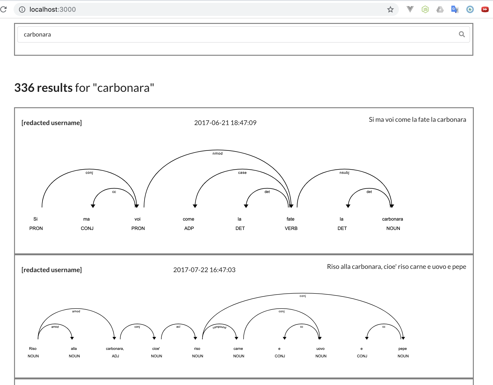

Chat simulator (and analysis) tools
=====

These tools allow to generate and store a chat corpus from Telegram, generate word embeddings and then try simulate a conversation based on different approaches. The simulation component is currently very lacking, I'm focusing on the visualization, but have some plans for that as well.

It's also possible to run some common NLP tasks such as dependency parsing using the `visualz` component, and get an interactive interface like this:

Everything is very experimental and messy, it's mainly my own test for a new stack based on React and asynchronous Python. If you try it, expect more than adventure.

## How to run
Copy `config.example.toml` to `config.toml` and fill it, then:

`make run`

you'll need Docker, Python 3.6 and patience.

To run the GUI look at the README in the `visualz` folder.

## Components

The project is a collection of sparse scripts to un manually, really.

However, these are the ideas behind the different files:

* *atomize* generates a JSONL file with "atoms" of conversation, used to train a model and evaluate models and humans
* *chat_simulator* calculates embeddings
* *visualz* allows to search through the DB and apply Spacy on the fly to the messages
